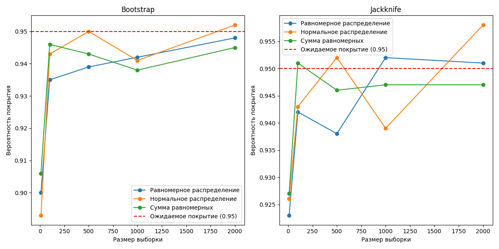

# Дз 2

В файле _main.py_ реализованы методы **_bootstrap_** и **_**jackknife**_** для оценки доверительных интервалов и проверки их покрытия для математического ожидания

- **Bootstrap**: Метод заключается в многократной генерации подвыборок с возвращением из исходной выборки и вычислении среднего значения каждой подвыборки. _Доверительный интервал оценивается как определенные процентили распределения этих средних значений_.

- **Jackknife**: Метод включает последовательное _исключение каждого элемента из выборки и вычисление среднего значения по оставшимся элементам_. Это позволяет оценить влияние каждого элемента на общее среднее.

График зависимости доли доверительных интервалов, содержащих точное значение математического ожидания, от размера выборки:

