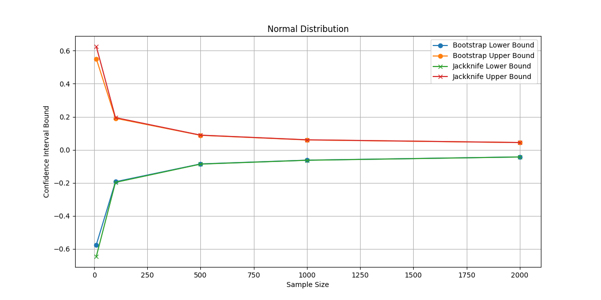
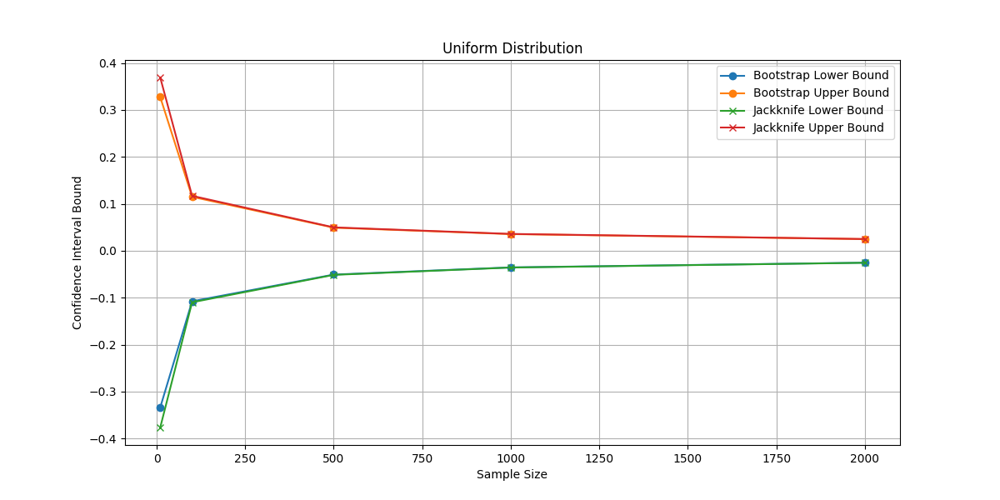
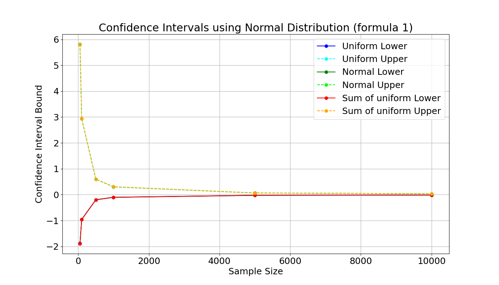
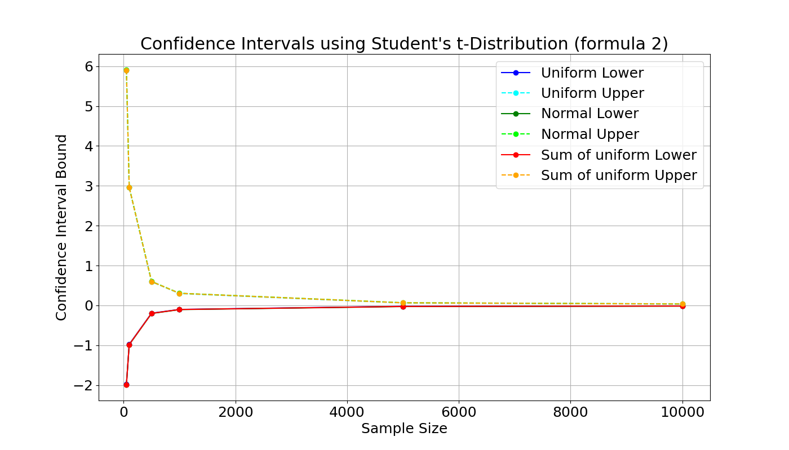
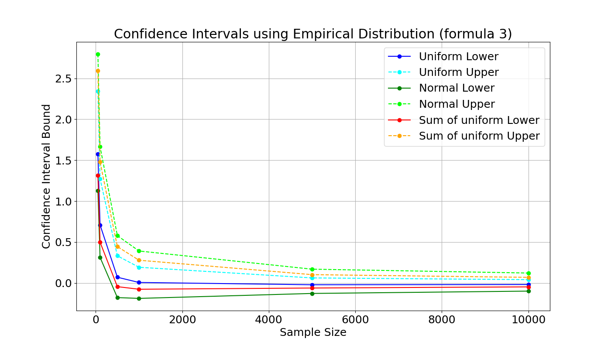

# Дз 3

## Bootstrap and jackknife
В файле _bootstrap_jackknife.py_ находится график зависимости доли доверительных интервалов от размера выборки для bootstrap и jackknife.
Он основывается на коде предыдущего дз (`hw-02/main.py`)

Графики для каждого распределения: 





## Чувствительность
В файле `sensitivity.py` реализована проверка чувствительности границ к выбросам (пункт 3 из дз).
За основу взят код с практики в папке `practice-03/main.py`

Графики для каждой формулы: 





## Оптимальное значение 
В файле `optimal_value.py` определено оптимальное значение величины, такой что при определенных a и b реальная доверительная вероятность совпадает с заданной
За основу взят код с практики в папке `practice-03/main.py`

Результат:
```
Generator: Uniform, Optimal k: 0.294, Actual Coverage Probability: 0.9493
Generator: Normal, Optimal k: 0.245, Actual Coverage Probability: 0.9505
Generator: Sum of uniform, Optimal k: 0.245, Actual Coverage Probability: 0.9495
```
