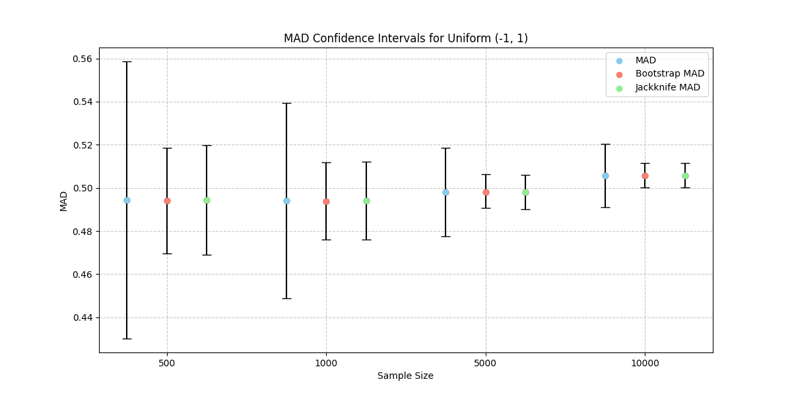
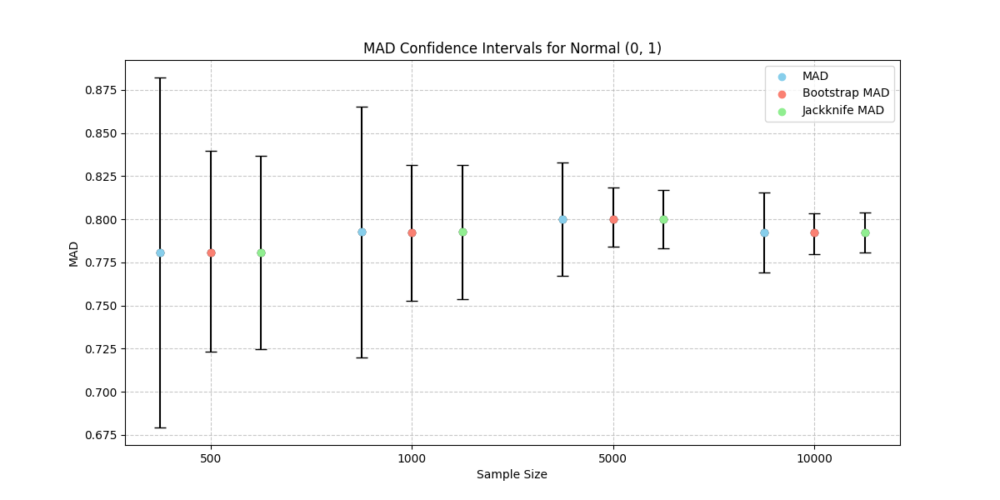
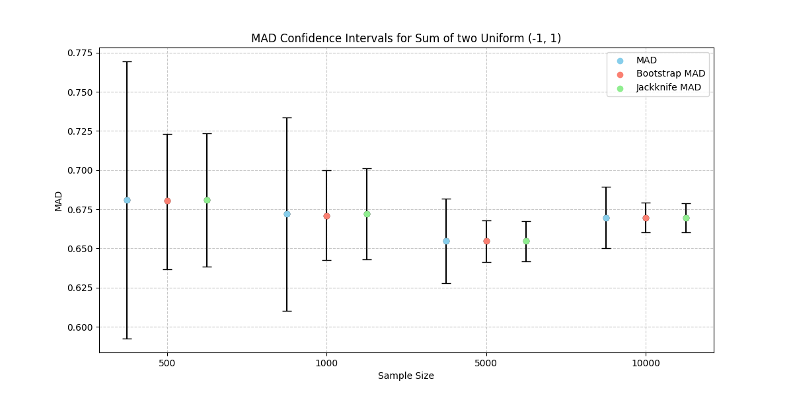

# Дз 4

В файле `main.py` решена задача оценки медианы абсолютных отклонений (MAD) для различных распределений и размеров выборок. 

Также найдены доверительные интервалы для MAD с использованием трех различных методов: обычной оценки, бутстрепа и джекнайфа

На графиках отображены значения медианы абсолютных отклонений и их доверительные интервалы для каждого метода:

**Вывод:**
- Для равномерного распределения Uniform(-1, 1) MAD стабильно около 0.5, что соответствует ожидаемой медиане абсолютных отклонений от медианы в таком распределении.
- Для нормального распределения Normal(0, 1) MAD находится около 0.8, что также соответствует теоретическим ожиданиям для такого распределения.
- Для суммы двух равномерных распределений Sum of two Uniform(-1, 1) MAD выше, чем для одного равномерного распределения, что связано с изменением формы распределения.
