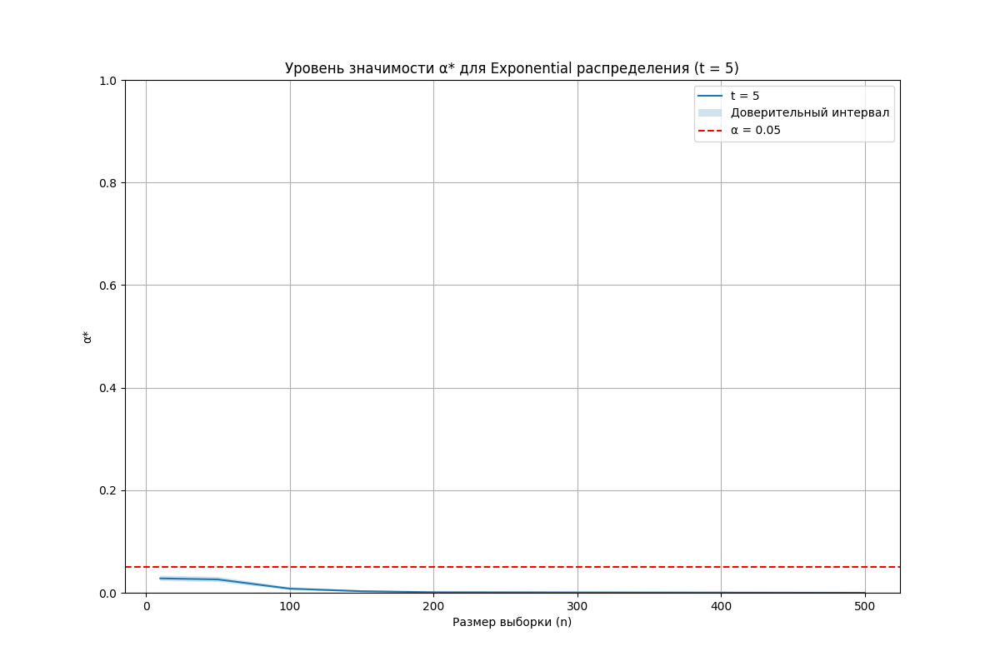
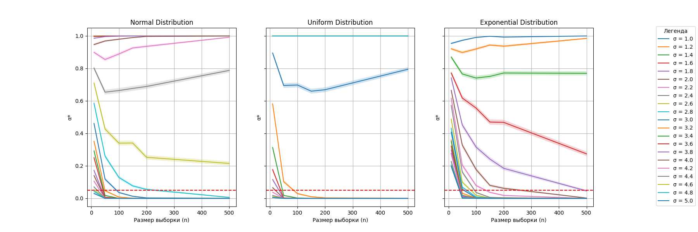

# Дз 11

Дз было реализовано по аналогии с практикой, находится в файле `task_6.py`:

Результат:

Вывод: 
1. **Графики и их анализ:**
   - **Для нормального распределения:** 
     Уровень значимости `alpha*` уменьшается с ростом размера выборки n, особенно когда дисперсия меньше 3. Однако при увеличении дисперсии уровень `alpha*` может оставаться высоким.
   - **Для равномерного распределения:**
     График показывает слабое соответствие гипотезе при больших значениях n и высоких значениях `sigma`, что приводит к росту значимости.
   - **Для экспоненциального распределения:**
     При `sigma < 3` `alpha*` быстро падает и стабилизируется при увеличении размера выборки. Для больших `sigma` уровень значимости остаётся высоким.

2. **По 95% доверительным интервалам:**
   На графиках видно, что в некоторых случаях значения `alpha*` выходят за пределы доверительного интервала `[-t, +t]`, особенно при малых n. Это подтверждает, что для проверки гипотезы `t = 5`, выполнение дополнительных измерений необходимо для повышения точности.

3. **Зависимость от размера выборки:**
   При увеличении n наблюдается общее снижение значимости `alpha*` во всех распределениях, особенно при малых значениях дисперсии `sigma`.

**Итого:**
Для выполнения гипотезы о среднем значении и контроле доверительных интервалов:
- Малый размер выборки приводит к несоответствию гипотезы и выходу `alpha*` за границы доверительного интервала.
- Увеличение размера выборки n значительно повышает точность, особенно при малых значениях дисперсии. 
- Экспоненциальное распределение требует более тщательного контроля для больших значений `sigma`.