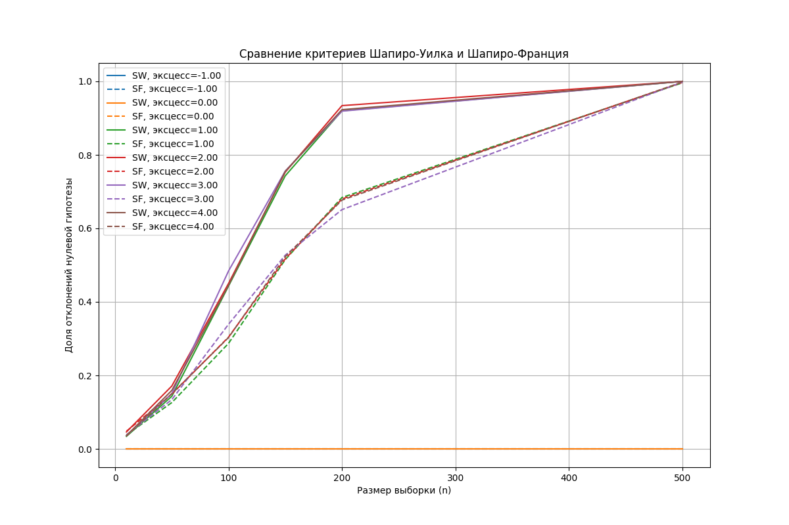

# Дз 12

Получившийся результат: 

Вывод:

- При увеличении размера выборки эффективность обоих критериев (Шапиро-Уилка и Шапиро-Франция) возрастает, что выражается в росте доли отклонения нулевой гипотезы.
- Для распределений с низким эксцессом (например, -1.00 и 0.00) критерий Шапиро-Франция более стабилен, показывая лучшую производительность в малых выборках.
- Для распределений с высоким эксцессом (например, 3.00 и 4.00) критерий Шапиро-Уилка оказывается более эффективным, особенно на выборках малого и среднего размера.

Рекомендация: выбирать критерий в зависимости от коэффициента эксцесса и размера выборки.

