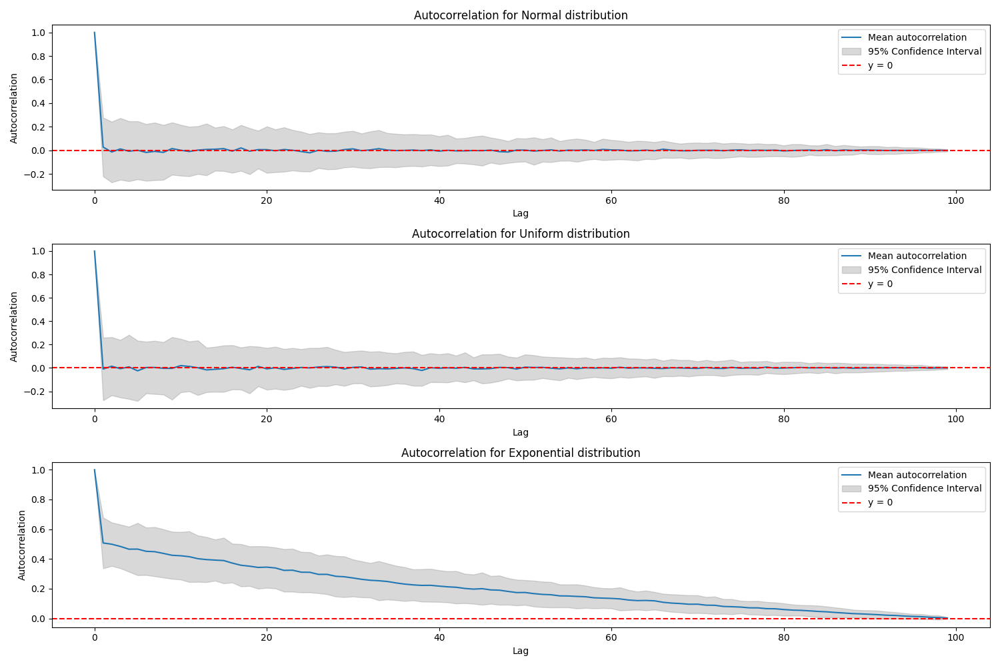
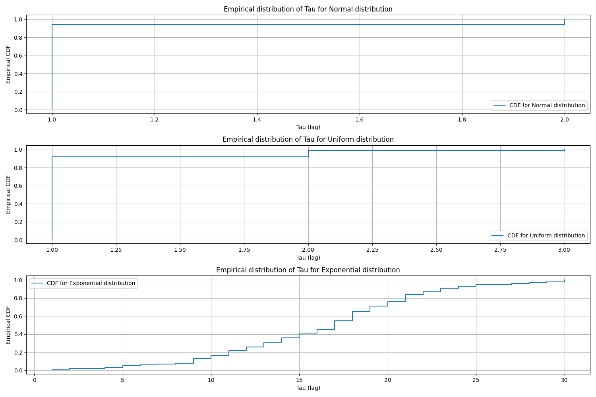

# Дз 13

Получившийся результат: 

**Вывод:**
- Нормальное и равномерное распределения показали схожее поведение с практически отсутствующей автокорреляцией уже после первого шага дискретизации (τ≈1)
- Экспоненциальное распределение демонстрирует медленное затухание автокорреляции, что указывает на его специфическую структуру, отличающуюся от других шумоподобных сигналов

