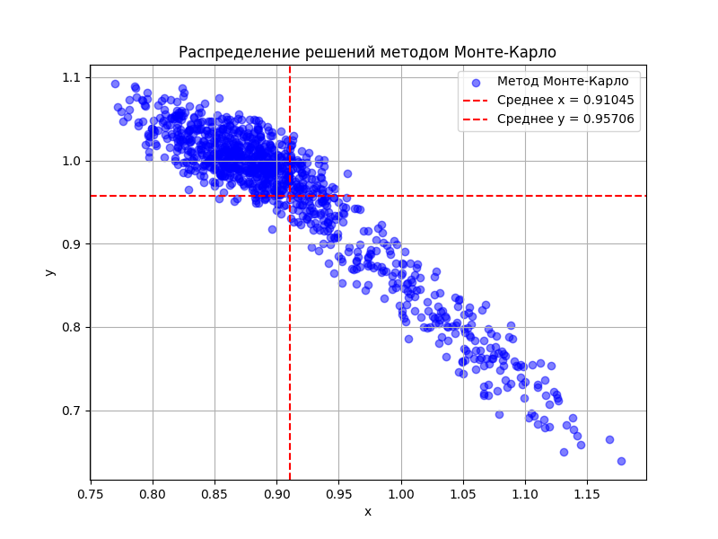

# Дз 14

Получившийся результат: 
```
Решение методом Ньютона: x = 0.86238, y = 1.00913
Среднее решение методом Монте-Карло: x = 0.91045, y = 0.95706
Решение аналитическим методом: x = 0.86238, y = 1.00913
Аналитическая погрешность: x = 0.19403, y = 0.13810
```


### Система уравнений
`a1 * x + a2 * y = b1` 

`a3 * x^2 + a4 * y^2 = b2`

### **Сравнение методов:**
1. **Метод Ньютона**:
   - Быстрое и точное решение для средних значений коэффициентов.
   - Не учитывает неопределённости параметров.

2. **Метод Монте-Карло**:
   - Показывает распределение решений с учётом неопределённостей коэффициентов.
   - Средние значения решений близки, но не совпадают с результатами Ньютона из-за случайного характера метода.

3. **Аналитический метод**:
   - Совпадает с результатами Ньютона.
   - Дополнительно предоставляет оценки погрешностей `Delta x` и `Delta y`, что позволяет количественно оценить влияние неопределённости параметров.

---

### **Вывод:**
- Среднее решение методом Монте-Карло `x = 0.91045`, `y = 0.95706` **близко**, но отличается от решений аналитического метода и метода Ньютона `x = 0.86238`,`y = 1.00913` из-за учёта вариаций параметров.
- Аналитическая погрешность показывает диапазон, в котором могут находиться корни при изменении параметров.

Таким образом, для задач с неопределённостями в коэффициентах **метод Монте-Карло** наиболее нагляден для визуализации, а **аналитический метод** обеспечивает точное решение с оценкой погрешности.
