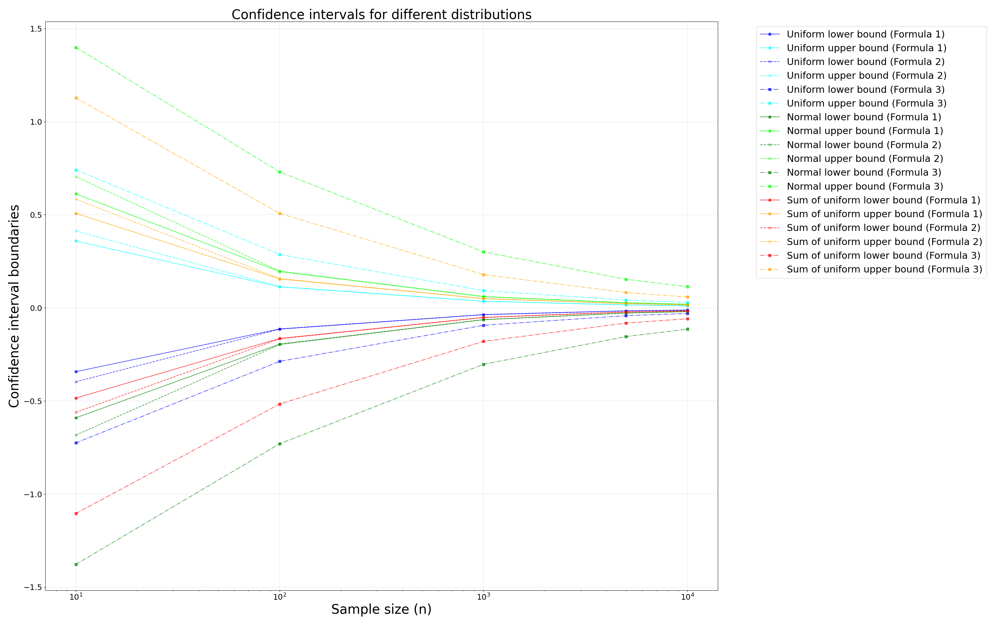

# Практика 3

Построен график зависимости границ доверительных интервалов от размера выборки для трех формул: 

**Выводы:**
- Первая и вторая формулы показывают схожие результаты по долям попаданий, находясь в диапазоне около 0.914 до 0.957 для всех распределений. Это указывает на то, что они обеспечивают приблизительно одинаковую надежность при оценке доверительных интервалов;

- Третья формула имеет значительно _более широкие границы_ по сравнению с формулами 1 и 2, особенно при меньших размерах выборки;

- Третья формула демонстрирует значительно _более высокие доли попаданий, достигая 0.999 и 1.0_ во всех случаях. Это указывает на избыточную ширину доверительных интервалов, что приводит к их излишней консервативности;
 
- Для всех формул наблюдается тенденция к _сужению доверительных интервалов с увеличением размера выборки._ Это ожидаемое поведение, так как большее количество данных позволяет более точно оценить параметры распределения.
  