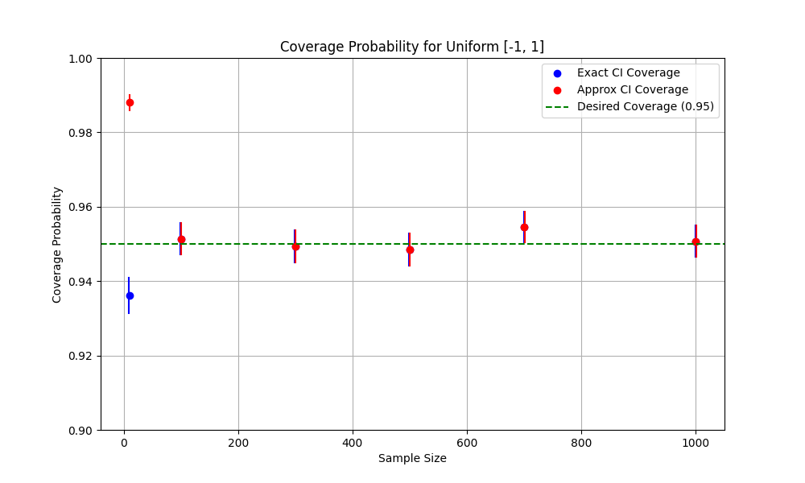
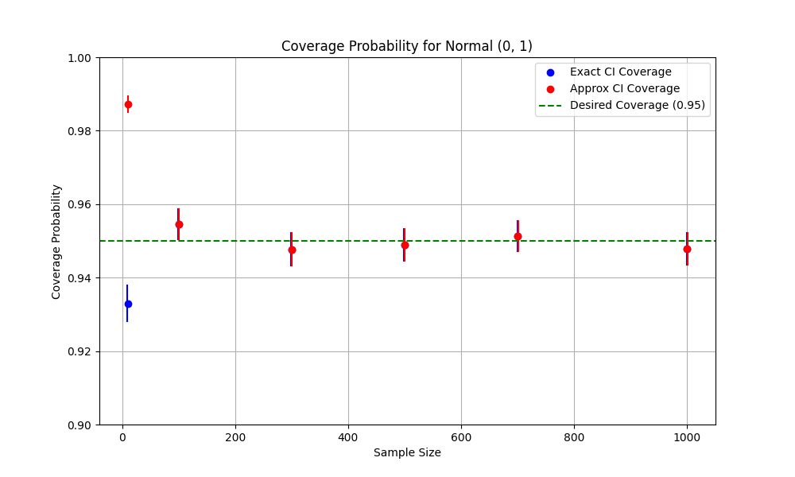
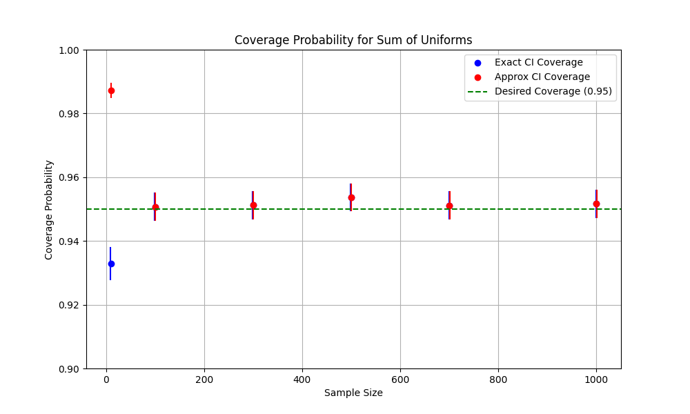

# Практика 4

## Пункт 1 

В файле `main.py` построены доверительные интервалы по точным соотношениям и по аппроксимации: 

Пример:
```
Uniform [-1, 1]: Size: 10, Median: 0, Exact CI: (0.11369145779071177, 0.5791831462016352), Approx CI: (-0.09928843741798277, 0.9516316855225437)
Uniform [-1, 1]: Size: 100, Median: 0, Exact CI: (-0.2868087000843258, 0.2719167253471104), Approx CI: (-0.2868087000843258, 0.2719167253471104)
Uniform [-1, 1]: Size: 300, Median: 0, Exact CI: (-0.1920540823507899, 0.0678218701660156), Approx CI: (-0.1920540823507899, 0.0678218701660156)
Uniform [-1, 1]: Size: 500, Median: 0, Exact CI: (-0.13985668180057376, 0.012359529009079662), Approx CI: (-0.13985668180057376, 0.012359529009079662)
Uniform [-1, 1]: Size: 700, Median: 0, Exact CI: (-0.038260260215097874, 0.13712040816260918), Approx CI: (-0.038260260215097874, 0.13712040816260918)
Uniform [-1, 1]: Size: 1000, Median: 0, Exact CI: (-0.08625423658484155, 0.06171999050264576), Approx CI: (-0.08625423658484155, 0.06171999050264576)
```
## Пункт 1.1
Найдены доверительные вероятности, построены их доверительные интервалы и нанесены на график для каждого распределения отдельно: 





## Пункт 1.2
Пример подсчета времени, затраченного на расчет по точным соотношениям и по аппроксимации: 
```
Uniform [-1, 1]: Size: 300, Median: 0, Exact CI: (-0.1963901123927978, 0.07685807026553526), Approx CI: (-0.1963901123927978, 0.07685807026553526)
Exact method time: 17.0660 seconds
Approximate method time: 1.2098 seconds
```

## Пункт 2 
Реализация находится в файле `quantiles.py`

Начиная с 368-ого размера (для 0.01) и с 555-ого размера выборки (для 0.99) границы доверительного интервала перестают включать соответственно X(1) и X(n)
```
Sum of Uniforms (Quantile 0.01): Exact CI excludes X_(1) or X_(n) at sample size: 368
Sum of Uniforms (Quantile 0.01): Exact CI: (-1.8073187268107935, -1.5603618345843966), Approx CI: (-1.8670345790336387, -1.5603618345843966) 

Sum of Uniforms (Quantile 0.99): Exact CI excludes X_(1) or X_(n) at sample size: 555
Sum of Uniforms (Quantile 0.99): Exact CI: (1.5463850037377644, 1.8285802979469328), Approx CI: (1.5463850037377644, 1.9236943434475102) 
```