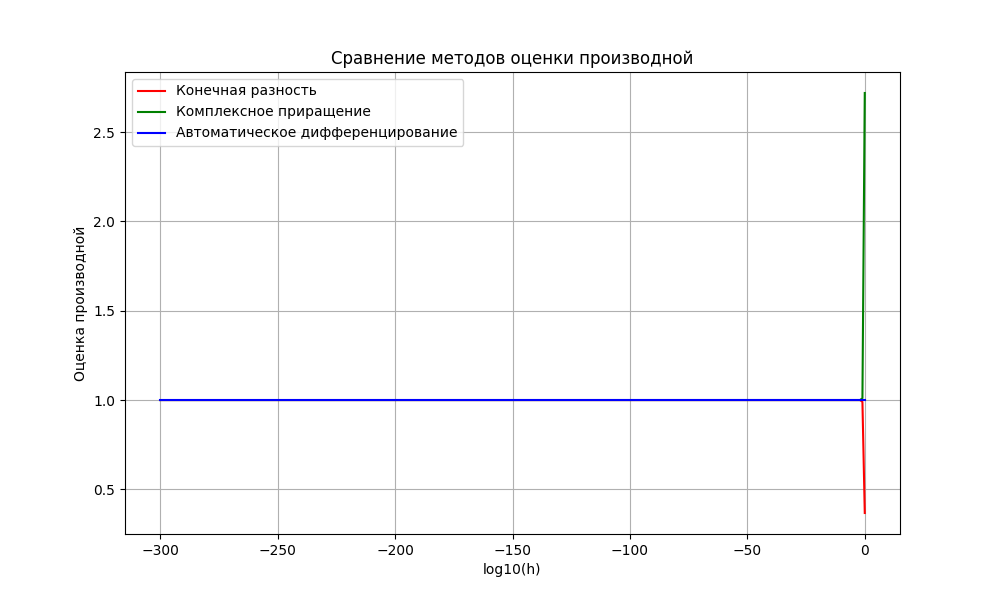
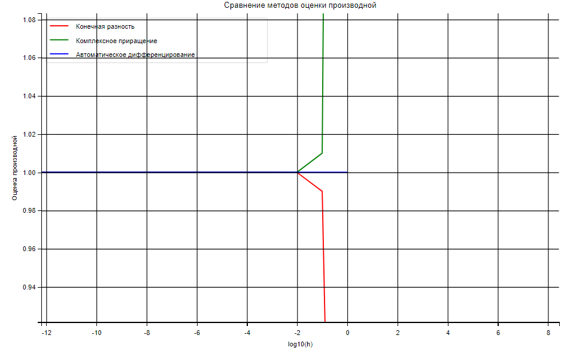

# Практика 7

## Пункты 1.1 - 1.3 

В файле `main.py` найдены оценки частных производных конечной разностью, методом комплексного приращения и реализовано автоматическое дифференцирование 



В масштабе: 



Результат:
```
h = 1e-07
Конечная разность: [1. 1. 1.]
Комплексное приращение: [1. 1. 1.]
h = 1e-06
Конечная разность: [1. 1. 1.]
Комплексное приращение: [1. 1. 1.]
h = 1e-05
Конечная разность: [1. 1. 1.]
Комплексное приращение: [1. 1. 1.]
h = 0.0001
Конечная разность: [0.99999999 0.99999999 0.99999999]
Комплексное приращение: [1.00000001 1.00000001 1.00000001]
h = 0.001
Конечная разность: [0.999999 0.999999 0.999999]
Комплексное приращение: [1.000001 1.000001 1.000001]
h = 0.01
Конечная разность: [0.9999 0.9999 0.9999]
Комплексное приращение: [1.00010001 1.00010001 1.00010001]
h = 0.1
Конечная разность: [0.99004983 0.99004983 0.99004983]
Комплексное приращение: [1.01005017 1.01005017 1.01005017]
h = 1
Конечная разность: [0.36787944 0.36787944 0.36787944]
Комплексное приращение: [2.71828183 2.71828183 2.71828183]
```

## Пункт 2 

В файле `interval_arithmetic.py` реализованы классическая интервальная и аффинная арифметика, выполнены расчеты наследственной погрешности

```
Результат с классической интервальной арифметикой: [[0.026516184408894156, 0.05476577520465034], [0.026516184408894156, 0.05476577520465034], [0.026516184408894156, 0.05476577520465034]]
Результат с аффинной арифметикой: [0.02651618440889418 ± 0.10548041734675373, 0.02651618440889418 ± 0.10548041734675373, 0.02651618440889418 ± 0.10548041734675373]
```
