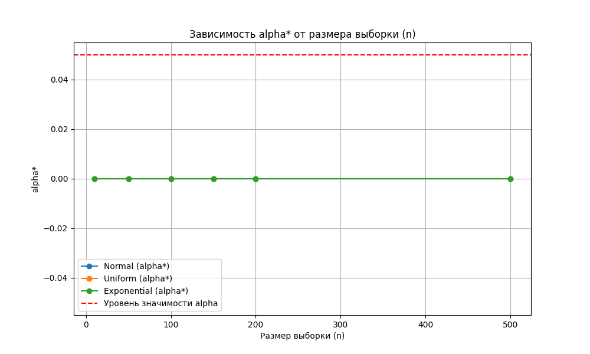
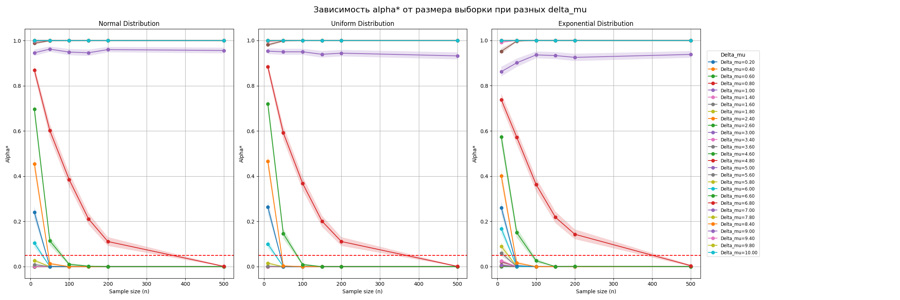
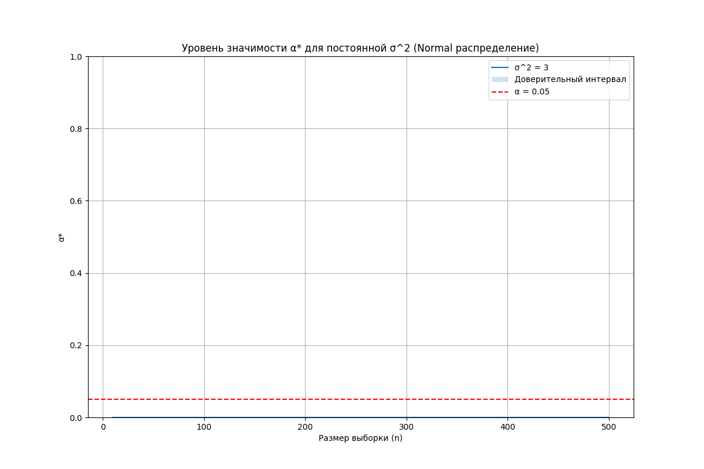
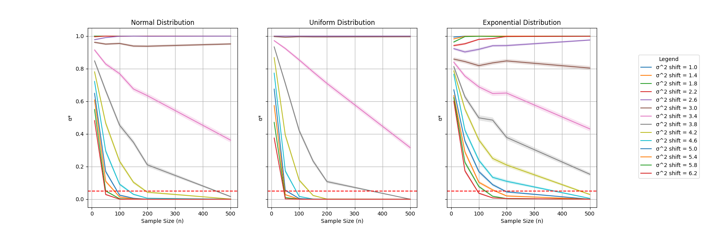
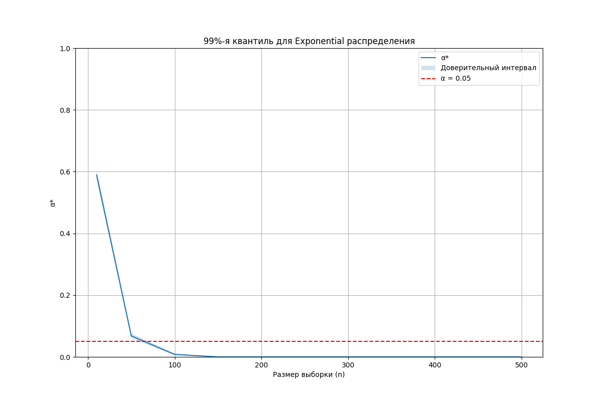
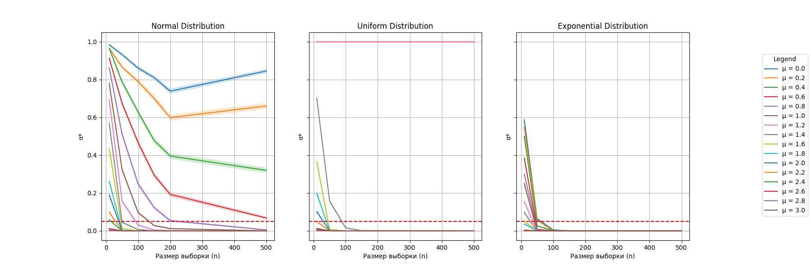

# Практика 11

Пункты 1-3 реализованы в файле `main.py`:

Результат для пункта 2: 

Результат для пункта 3: 

Пункт 4 реализован в файле `task_4.py`:

Результат: 

Пункт 5 реализован в файле `task_5.py`:

Результат: 

