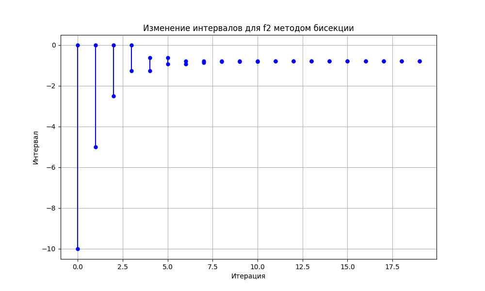

# Практика 14

```
Результаты для f1:
Корни не найдены методом Монте-Карло.
Корни не найдены методом бисекции.
Аналитическое решение: x1 = 0.00000, x2 = -0.00000

Результаты для f2:
Средний корень методом Монте-Карло: -0.79324
Интервалы для корня после бисекции: [(-0.7925605773925781, -0.79254150390625)]
Аналитическое решение для f2: x = -0.79255
```

#### **1. Результаты для `f_1(x) = a_2 x^2 + a_1 x + a_0`:**
- **Корни не найдены методом Монте-Карло**:
   - Метод Монте-Карло не нашёл решений, так как уравнение является квадратичным, и его дискриминант `D = a_1^2 - 4a_2a_0` часто оказывается **отрицательным**. 
   - Коэффициенты:
     - a_2 принадлежит `[1.0, 1.1]`: положительное значение.
     - a_1 принадлежит `[-0.1, 0.1]`: почти нулевое значение.
     - a_0 принадлежит `[-0.1, 0.1]`: почти нулевое значение.
   - При таких значениях коэффициентов дискриминант оказывается недостаточным для существования вещественных корней.

- **Корни не найдены методом бисекции**:
   - Интервальная бисекция проверяет изменение знака функции на заданном интервале `[-10, 10]`.
   - Так как уравнение не имеет вещественных корней, функция не изменяет знак на этом интервале, что приводит к невозможности нахождения корней методом бисекции.

- **Аналитическое решение**:
   - Решение уравнения `a_2x^2 + a_1x + a_0 = 0` с фиксированными средними значениями коэффициентов:
     - `a_2 = 1.05`, `a_1 = 0.0`, `a_0 = 0.0`.
     - Дискриминант `D = a_1^2 - 4a_2a_0 = 0`, что приводит к **двойному корню в нуле**:
       - `x_1 = 0.00000`, `x_2 = -0.00000`.

**Вывод**: Уравнение `f_1` при текущих диапазонах коэффициентов имеет решение только в виде одного двойного корня, но в большинстве случаев численные методы не находят его из-за отрицательного дискриминанта.

---

#### **2. Результаты для `f_2(x) = \exp(a_2 * x) + a_1 * x + a_0`:**
- **Средний корень методом Монте-Карло**:
   - Найденный корень: `x = -0.79324`.
   - Метод Монте-Карло использует случайные комбинации коэффициентов `a_2, a_1, a_0` и решает уравнение численно. Полученный результат усреднён по всем итерациям.

- **Метод интервальной бисекции**:



   - Найденный интервал: `[-0.7925605773925781, -0.79254150390625]`.
   - На каждой итерации интервал, содержащий корень, **сужается**, что видно на графике:
     - Сначала происходит резкое уменьшение интервала.
     - На последних шагах интервал стабилизируется с заданной точностью `10^{-5}`.

- **Аналитическое решение**:
   - Численный метод Ньютона на фиксированных средних значениях коэффициентов:
     - `a_2 = 1.05`, `a_1 = 2.0`, `a_0 = 1.15`.
   - Найденный корень: `x = -0.79255`.

- **Аналитическая погрешность**:
   - Используя частные производные уравнения по коэффициентам `a_0, a_1, a_2`, аналитическая погрешность составляет: `Delta x = 0.16070`
   - Это значение показывает, насколько сильно изменяется корень при вариациях коэффициентов.

---

### **Сравнение результатов для `f_2`**:
| Метод                   | Результат корня \( x \)           | Погрешность \( \Delta x \) |
|-------------------------|-----------------------------------|---------------------------|
| **Монте-Карло**         | \( -0.79324 \)                   | —                         |
| **Интервальная бисекция** | Интервал: \([-0.792560, -0.792541]\) | —                         |
| **Аналитический метод** | \( -0.79255 \)                   | \( 0.16070 \)             |

---

### **Итоговый вывод**:
1. **Для `f_1`**:
   - Корни не найдены численными методами из-за отрицательного дискриминанта в большинстве случаев.
   - Аналитическое решение показало наличие одного двойного корня в нуле.

2. **Для `f_2`**:
   - Все три метода показали **согласованные результаты**:
     - Монте-Карло дал средний корень.
     - Интервальная бисекция подтвердила точное положение корня с минимальным интервалом.
     - Аналитический метод (с численным решением) дал близкий результат с оценкой погрешности.

**Результаты для `f_2` доказывают надёжность численных методов при решении нелинейных уравнений с неопределёнными коэффициентами.**
